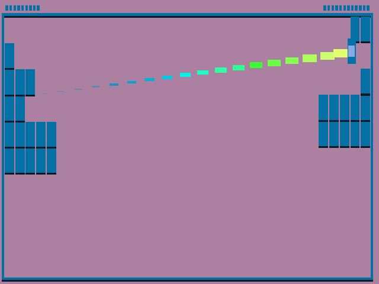

# Self Breakers

Author: 
Jan Orlowski

Design: 
Initally based on brick breaker. Two players control a stack of bricks which can be broken by a ball that flies inbetween. The first to break all of their bricks wins!

Screen Shot:

How To Play:
Use the mouse to move your stack of bricks so that the bricks get hit by the ball.

This game was built with [NEST](NEST.md).
